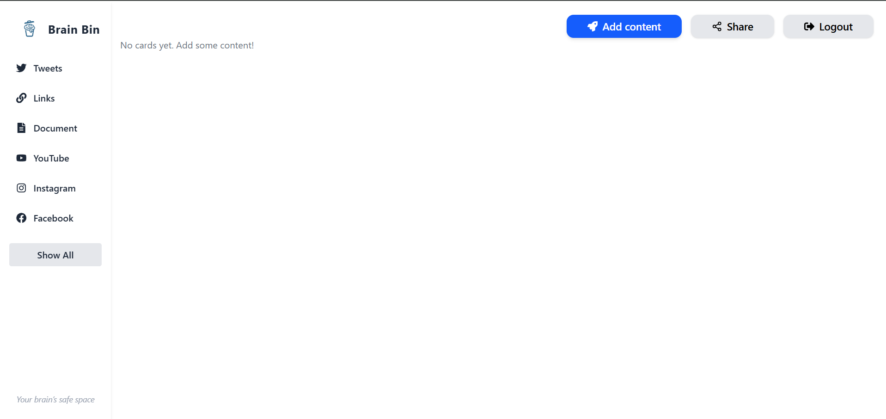

# 🧠 BrainBin – Your Second Brain for Productivity

BrainBin is a **Second Brain web application** built with the **MERN stack** that helps you **capture, organize, and revisit** all the digital content you care about.  
Whether it’s a **Twitter thread**, a **YouTube video**, an **Instagram post**, or a **Facebook link**, BrainBin lets you save them all in one central place for easy access later.  

Boost your productivity by never losing valuable content again.  

---
## 📸 Screenshots

### Dashboard



## 📂 Project Structure

BrainBin/
│
├── frontend/ # React + Tailwind (or other stack) user interface
├── backend/ # Express + MongoDB API server
└── README.md # Project documentation


---

## ✨ Features

- 📌 Save links from **Twitter, YouTube, Instagram, Facebook**, and more  
- 🗂️ Organize your links like a personal **knowledge vault**  
- 🔍 Powerful search to quickly find stored content  
- 🖼️ Rich preview of saved links (thumbnails, titles, descriptions)  
- 🔐 Secure authentication & user accounts  
- 📱 Responsive design for desktop & mobile  
- ⚡ Fast and optimized for productivity-focused workflows  

---

## 🛠️ Tech Stack

**Frontend**  
- React.js  
- Tailwind CSS (or your chosen UI framework)  
- Axios  

**Backend**  
- Node.js  
- Express.js  
- MongoDB (Mongoose)  
- JWT Authentication  

---

## 🚀 Getting Started

### 1. Clone the Repository
```bash
git clone https://github.com/yourusername/brainbin.git
cd brainbin

2. Setup Backend

cd backend
npm install
npm run dev

Make sure you set up your .env file inside /backend:

PORT=5000
MONGO_URI=your_mongodb_connection_string
JWT_SECRET=your_secret_key

3. Setup Frontend

cd ../frontend
npm install
npm start

4. Open in Browser

Visit 👉 http://localhost:3000

🧑‍🤝‍🧑 Contributing

Contributions are welcome! Here’s how you can help:

Fork the repo

Create a new branch (feature/awesome-feature)

Commit changes (git commit -m "Added awesome feature")

Push to branch (git push origin feature/awesome-feature)

Open a Pull Request

📜 License

This project is licensed under the MIT License.
Feel free to use, modify, and share it.

👨‍💻 Author

Krishna Sahu
📧 krishna.sahu.work@gmail.com

🌟 Acknowledgements

Inspired by the concept of a Second Brain for productivity

Built with ❤️ using MERN stack