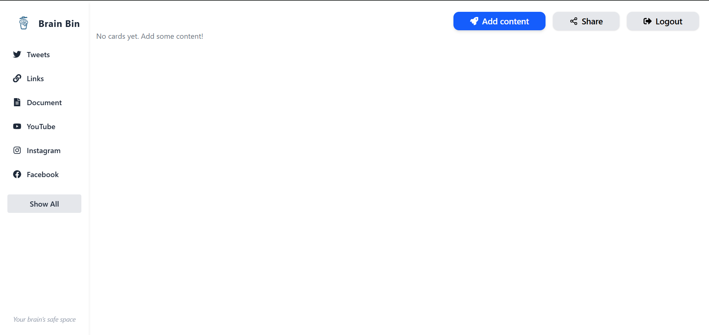
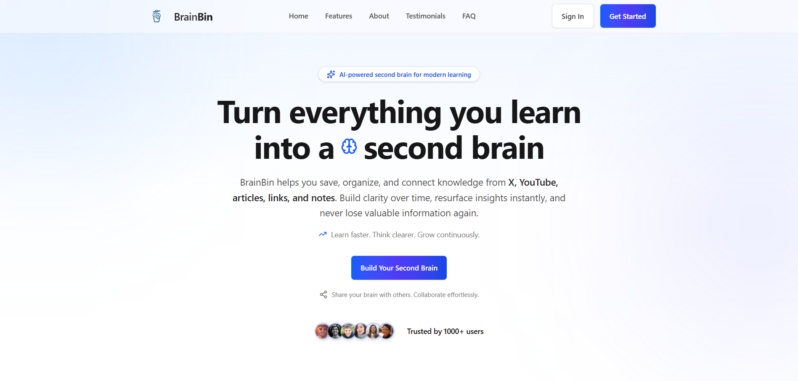

# 🧠 BrainBin – Your Second Brain for Productivity

BrainBin is a **Second Brain web application** built on the **MERN stack**, designed to help you **capture, organize, and revisit** the digital content that matters to you.

Save a **Twitter thread**, a **YouTube video**, an **Instagram post**, or a **Facebook link** — all in one centralized, searchable space. Stop losing valuable content in scattered bookmarks, tabs, and screenshots. Start building a knowledge vault that works for you.

---

## 📸 Screenshots

### Dashboard
Your central hub for viewing and managing all saved content at a glance.



### Content View
A closer look at how saved links are organized with rich previews and metadata.



---

## 📂 Project Structure

```
BrainBin/
│
├── frontend/     # React + Tailwind CSS user interface
├── backend/      # Express + MongoDB API server
└── README.md     # Project documentation
```

---

## ✨ Features

- 📌 **Save from anywhere** — Twitter, YouTube, Instagram, Facebook, and more
- 🗂️ **Organize** your links like a personal knowledge vault
- 🔍 **Search** to quickly locate stored content
- 🖼️ **Rich previews** — thumbnails, titles, and descriptions for saved links
- 🔐 **Secure authentication** with user accounts
- 📱 **Responsive design** across desktop and mobile
- ⚡ **Fast and lightweight**, optimized for productivity workflows

---

## 🛠️ Tech Stack

**Frontend**
- React.js
- Tailwind CSS
- Axios

**Backend**
- Node.js
- Express.js
- MongoDB (Mongoose)
- JWT Authentication

---

## 🚀 Getting Started

Follow these steps to run BrainBin locally.

### 1. Clone the Repository

```bash
git clone https://github.com/krishnasahu22032003/brainbin.git
cd brainbin
```

### 2. Set Up the Backend

```bash
cd backend
npm install
npm run dev
```

Create a `.env` file inside `/backend` with the following variables:

```env
PORT=5000
MONGO_URI=your_mongodb_connection_string
JWT_SECRET=your_secret_key
```

### 3. Set Up the Frontend

```bash
cd ../frontend
npm install
npm start
```

### 4. Open in Browser

Visit 👉 [https://brainbin.krishnastack.com](https://brainbin.krishnastack.com)

---

## 🧑‍🤝‍🧑 Contributing

Contributions are welcome and appreciated! To contribute:

1. Fork the repository
2. Create a new branch (`git checkout -b feature/awesome-feature`)
3. Commit your changes (`git commit -m "Added awesome feature"`)
4. Push to the branch (`git push origin feature/awesome-feature`)
5. Open a Pull Request

---

## 📜 License

This project is licensed under the **MIT License**.
Feel free to use, modify, and share it.

---

## 👨‍💻 Author

**Krishna Sahu**
📧 krishna.sahu.work@gmail.com

---

## 🌟 Acknowledgements

- Inspired by the concept of a "Second Brain" for productivity
- Built with ❤️ By Krishna Sahu.